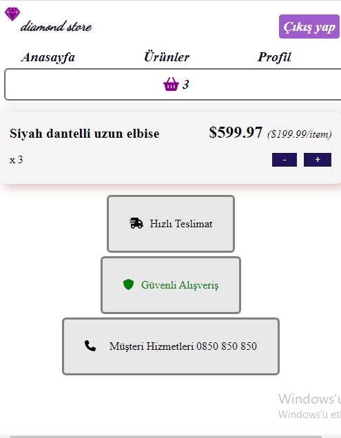

# E-commerce Project With Redux

Projemi develop branchında geliştirip geliştirme bittikten sonra main branchı ile merge ederek tamamladım.  State yönetim aracı olan Redux üzerinde çalışmak ve bilgimi pekiştirmek amacıyla bu projeyi oluşturdum. Redux ile bir e-commerce sitesinde sepete ürün ekleme , çıkarma işlemlerini gerçekleştirdim. Kullanıcı Auth işlemlerini firebaseAuth ile yaptım , kullanıcı hesap oluşturup giriş yapınca ürünleri sepete ekleme işlemi yapabilir , navbardaki profil linkinden kullanıcı şifre değişikliğini yapabilir.

## Neden Redux?
Redux ı seçmemin sebebi contextAPI'dan farklı olarak daha global bir state yönetimi sağlar örneğin oluşturduğum Auth işlemleri için kullanıcı girişi yapılınca hem navbardaki linklere hem de productList componentindeki ürünlerin butonuna etki ediyor bu yüzden Redux global olması sebebiyle daha uygun.Redux Toolkit paketi Redux kullanımını slicelar aracılığıyla daha kolay hale getiriyor 
 
 ## Kütüphaneler
 + React
 + react-router-dom v6.4
 
 ## Stil
 + SCSS
 
 ## Auth işlemleri için kullanılan database
 + FirebaseAuth
 
 ## State Yönetimi
 + Redux, Redux Toolkit
 
## Kaynaklar
+ Firebase Auth : https://firebase.google.com/docs/reference/rest/auth
+ https://academind.com

## Demo
https://e-commerceredux.netlify.app/

